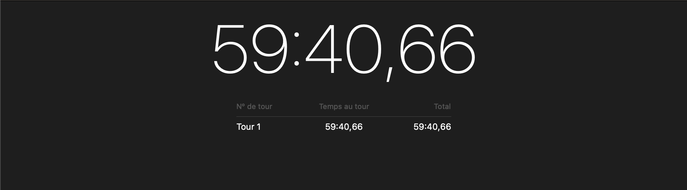

# Getting Started with Create React App

This project was bootstrapped with [Create React App](https://github.com/facebook/create-react-app).

## Available Scripts

In the project directory, you can run:

### Project Details 
The objective is to make a reproduction in 1 hour, an improvement will be made on a branch afterwards to have the perfect rendering.

#### `npm start`

Runs the app in the development mode.\
Open [http://localhost:3000](http://localhost:3000) to view it in your browser.

####

